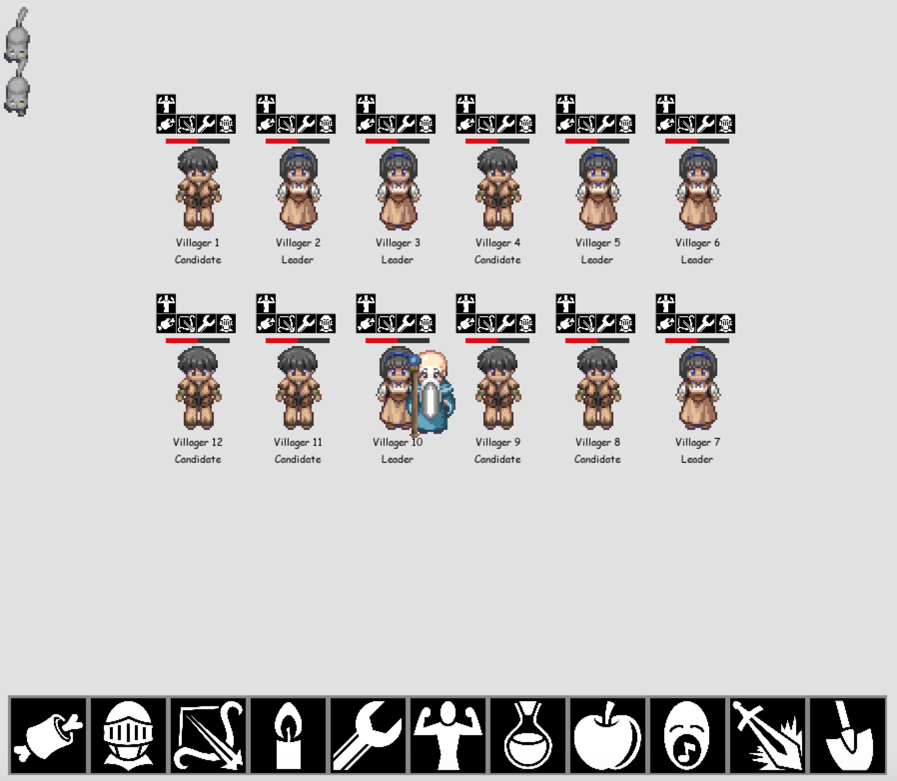

# Distributed Algorithm Project - Raft Implementation

## Introduction

This Raft program is implemented by following Raft paper (https://raft.github.io/)
  - Note: there is a slight modification on judging which node's log is better that we use the length of the log.

This is a project for Distributed Algorithm subject in The University of Melbourne.

In this project, a strategy game named *Heritage* is implemented. 

The game is about a small village with 12 villagers happily living in it. 

However, during the nights, monsters (cute cat) come out and attack villagers, and villagers without any protections would be easily killed. 

All the villagers in this town believe in democracy and a leader can only be elected if the majority of the villagers vote for him. 

A villager will only vote for someone who has equal amount of knowledge as him/her or more.  

A sage, which also lives in the village and is controlled by the player, knows all the knowledges about how a villager should kill monsters, protect and heal him/herself, but he is old and only has the energy to pass the knowledges to the leader and let the leader further distribute them to the rest of the villagers.
  - User/Player could simple control Sage to pass down the knolwedge by click the icon in the button item bar.

Raft is the algorithm chosen to elect leader and replicate the log, which contains all the knowledge taught by the sage, from the leader to the villagers in the backend of this game. 

Note: Only when majority of the Villagers learn the knowledge, the leader(user/player) can start passing down another knowledge.

## How to Run the project

### Folder: raft_peer

`raft_single.py` is the main file which starts the Raft program.

**Pre-requisite:**

To run this program, you need to install jsonpickle.

Simply run: `pip install jsonpickle' or 'pip3 install jsonpickle`

This program should be run with Python3, it is not compatible with Python2

The `raft_peer.ini` file should be included in the same folder, you should modify
the peer names, ports and timeouts in the `raft_peer.ini` file before
start the raft program and make sure all the peers get the same one.

**How to run Raft:**

use the command:

`python3 raft_sinlge peername peernum [-v]`

-v is optional flag for connecting to our game to visualize the Raft algorithm in gameplay.

peername should be in the `raft_peer.ini` file
the total number of peers should not exceed the number of peer names in raft_peer.ini file.

**Example run:**

`python3 raft_single peer1 3` -> this will launch a peer and he will assume there are 3 peers
in total in this Raft system.

`python3 raft_single peer2 3` -> peer2 join the above system

`python3 raft_single peer3 3` -> peer3 join the above system

**Raft run with visualization/game:**

`python3 raft_single peer1 3 -v ` -> this will launch a peer and he will assume there are 3 peers
in total in this Raft system and visualization game is started before running peers

`python3 raft_single peer2 3 -v` -> peer2 join the above system

`python3 raft_single peer3 3 -v` -> peer3 join the above system

`launch_raft_peer.sh` could be used to automatically start peers

**launch_raft_peer.sh Example:**

`sh launch_raft_peer.sh 3` -> will launch 3 peers, and their name is peer1, peer2 and peer3

Inside the folder `RaftPeer.py` is the core file which contains all the logics of Raft with the
help of other classes.

Its responsibility is to send, receive, and processing the PRCs, we use JSON as our message
passing protocol for simplicity.

`TimeoutCounter` is the random timeout class, which will start election or sending append entreis.

The state of the peer is stored in class `RaftPeerState`, all other class are used to forming the
RPCs JSON needed to be sent according to current `RaftPeerState` and the current state of the
Raft system. Log is stored as list of instances of `LogData (LogData.py)` class.

**The CLI tester User.py**

You could start `User.py` by by running

`python3 User.py 3` -> 3 indicates that there are three peers in the system, and their names are
peer1, peer2 and peer3, User.py needs `raft_peer.ini` for working correctly.

Some commands you can execute in User.py through keyboard:

`['x', 'add', '100']` => this command will send request_command to leader and ask to add x to 100

PS: User.py might take some time to find leader, so you should wait for it stops printing messages
and hit enter to enter the above sample command. You should run this command line interface tester
after you run the Raft program.

#### Folder: Visualization

`game.py` is the main file which starts the game program for visualizing Raft in gameplay

**How to run:**

**Pre-requisite:**

To run this program, you need to install pygame.

Simply run: `pip install pygame` or `pip3 install pygame`

This program should be run with Python3, it is not compatible with Python2

The port used in visualization could be modified in `constant.py` (GAME_HOST, GAME_PORT) and make sure
the host ip and port are in the `raft_peer.ini` file for every peers.

**Example run:**

`python3 game.py`

Note: You should run *Heritage* game before you run the Raft program (`python3 raft_sinlge peername peernum -v`).

You could use key `s` to stop monster attacking villager and click the villager to kill him/her
for showing Raft properties.

#### Folder: raft_peers/logs

This folder will contain all the logs of each started peers, so make sure you have folder named
`logs` in the same folder for Raft program

For sample RPCs used in this Raft system, you could check out the following table.

## Team Members:
- Regina Zhang - 646179
- Bingfeng Liu - 639187 
- Jimmy Chiang - 822373
- Wen-Pin Wu - 871702 

## Milestones

- Raft Leader Election
- Raft Game
- Bridging Raft and Game
- Report
- Snapshot Algorithm based on Raft Leader Election

## Current Game Screenshot

## RPCs Examples in Raft

RPC Message Type | Example JSON format | Description
---------------- | ------------------- | -----------
request_vote_reply | {"msg_type": 'request_vote_reply', 'send_to': ['localhost', 10002], 'send_from': ['localhost', 10001], 'sender_term': 5, 'vote_granted': True} | Used to reply the candidate’s vote requesting.
request_vote | {"last_log_index": 1, "last_log_term": 2, "msg_type": "request_vote", "peer_id": "peer2", "send_from": ["localhost", 10002], "send_to": ["localhost", 10001], "sender_term": 5} | Used for candidate to broadcast to request vote
append_entries_leader ( no entries) | {"leader_commit_index": -1, "msg_type": "append_entries_leader", "new_entries": [], "peer_id": "peer2", "prev_log_index": 1, "prev_log_term": 2, "send_from": ["localhost", 10002], "send_to": ["localhost", 10001], "sender_term": 5} | Used for leader to send out its heartbeat or appendEntries
append_entries_leader (with entries)|{"leader_commit_index": -1, "msg_type": "append_entries_leader", "new_entries": [{"py/object": "LogData.LogData", "log_applied": false, "log_index": 1, "log_term": 2, "majority_count": 0, "request_command_action_list": ["x", "add", "100"], "request_user_addr_port_tuple": null}, {"py/object": "LogData.LogData", "log_applied": false, "log_index": 2, "log_term": 5, "majority_count": 1, "request_command_action_list": ["x", "add", "100"], "request_user_addr_port_tuple": ["127.0.0.1", 59182]}], "peer_id": "peer2", "prev_log_index": 0, "prev_log_term": 1, "send_from": ["localhost", 10002], "send_to": ["localhost", 10001], "sender_term": 5} | This is an example appendEntries which included the logs.
append_entries_follower_reply | {'log_index_start': -1, 'log_index_end': -1, 'send_from': ['localhost', 10001], 'send_to': ['localhost', 10002], 'sender_term': 5, 'append_entries_result': False, 'msg_type': 'append_entries_follower_reply'} | Used to reply the leader’s append_entries_leader message.
request_command | {"msg_type": "request_command", "request_command_list": [], "send_to": ["127.0.0.1", 20001], "send_from": ["127.0.0.1", 59162]} | Used by user to request performing certain commands in the system.
request_command (learn_skill) | {"msg_type": "request_command", "request_command_list": ["armour", "learn_skill", true], "send_from": ["127.0.0.1", 59894], "send_to": ["127.0.0.1", 20002]} | One example of user sending commands to add skill variable in the Log of each peer
request_command_reply | {'msg_type': 'request_command_reply', 'command_result': 'not_leader', 'send_from': ('127.0.0.1', 20001), 'send_to': ['127.0.0.1', 59162]} | Used to reply to the user about the result of the command. If received the empty command_list in request_command JSON the command result will be either ‘not_leader’ or ‘is_leader’ to inform the user whether it connected to the leader or not.
